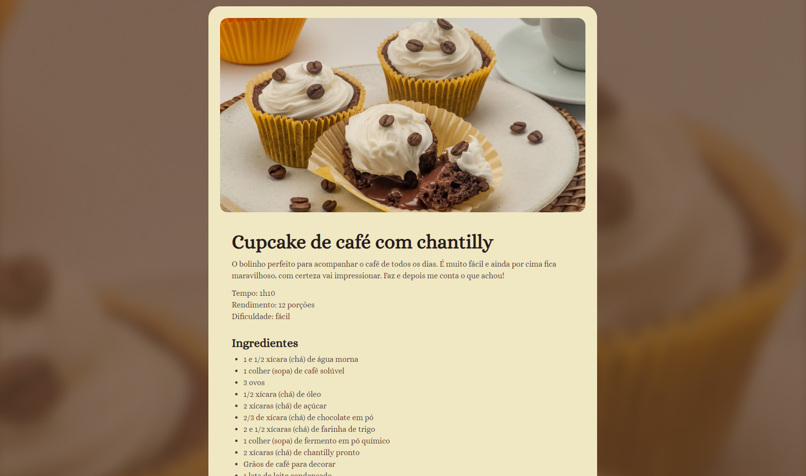

<h1 align="center">  Página de Receita - Cupcake de Café com Chantilly  </h1>

Este projeto é uma página simples desenvolvida em HTML e CSS para apresentar a receita de um delicioso cupcake de café com chantilly. Ideal para quem deseja aprender ou aprimorar habilidades básicas em desenvolvimento front-end.

## 📝 Descrição

A página apresenta:
- Uma introdução sobre a receita, incluindo informações como tempo de preparo, rendimento e nível de dificuldade.
- A lista de ingredientes necessários para preparar o cupcake.
- As instruções detalhadas para o modo de preparo.

## 🚀 Tecnologias Utilizadas

- **HTML5**: Estrutura principal da página.
- **CSS3**: Estilização da página.
- **Google Fonts**: Fonte Alice foi utilizada para melhorar a tipografia.

## 🎨 Layout
[Figma](https://www.figma.com/design/wUDGqVhOdWPfSFT6DUcHKu/P%C3%A1gina-de-receita-(Community)?node-id=0-1&p=f&t=pr45E0dzAGOSNviM-0)





## 📂 Estrutura do Projeto

```plaintext
pag-receita/
├── src/
│   ├── index.html         # Arquivo principal da página
│   ├── style.css          # Arquivo de estilos
│   ├── assets/            # Recursos visuais (imagens, ícones, etc.)
│       ├── main-image.jpg # Imagem principal da página
│       ├── heart.svg      # Ícone de coração no rodapé
```

## 🖼️ Pré-visualização

A página exibe:
- Uma imagem principal ilustrativa.
- Sessões organizadas para descrição, ingredientes e modo de preparo.
- Rodapé personalizado com um ícone de coração e a autoria do projeto.

## 📋 Como Utilizar

1. Clone ou faça o download deste repositório.
2. Abra o arquivo `index.html` em qualquer navegador.

## 📌 Funcionalidades

- Layout responsivo para diferentes tamanhos de tela.
- Design limpo e intuitivo.

## ✨ Créditos

Feito com ❤️ pela **Gelzieny R. Martins**.

